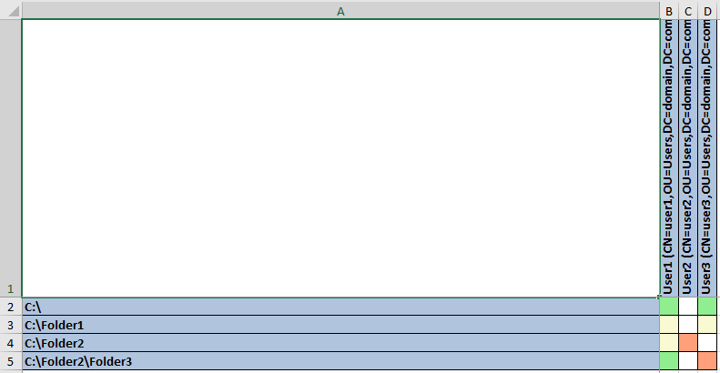

# aclmatrix
Small utility which analyses folder tree permissions and displays them as a matrix in a Microsoft Excel worksheet. Quite useful for investigating permissions to a shared folder.\
\
\
\
Usage: ACLMatrix.exe root_path output_file.xlsx [ShowAccountNames] [BypassACL]\
\
Caveats:
1. This tool retrieves folder permissions. If you grant access on a file level, you are on your own to update this according to your needs. However, it might be worth to reconsider approach to access rights' distribution
2. You may run it for a shared folder under an account, which has access to the subject directory tree and permissions to read relevant active directory data. Performance will be higher if you run this tool on a file server. If you run it under an account with administrative permissions, you may use BypassACL command line argument, so that you can retrieve data for folders, you are restricted to access due to NTFS permissions

